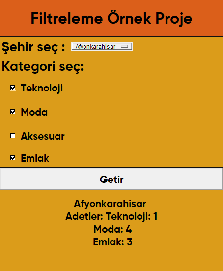

# İl Kategori Gösterici Uygulaması

Bu basit uygulama, bir şehir ve kategori seçimi ile ilişkilendirilmiş verileri gösteren bir Tkinter GUI uygulamasıdır.

## Nasıl Kullanılır

1. **Şehir Seçimi:**
   - Sağ üst köşede yer alan "Şehir Seç" menüsünden bir şehir seçin.

2. **Kategori Seçimi:**
   - "Kategori Seç" bölümünden bir veya daha fazla kategori seçin.

3. **Veri Getirme:**
   - "Getir" düğmesine tıklayarak seçilen şehir ve kategorilere ait verileri görüntüleyin.

4. **Hata Mesajları:**
   - Eğer geçersiz bir şehir veya kategori seçimi yapılırsa, alt kısımda hata mesajları görüntülenecektir.

## Örnek Görüntü



## Kurulum

Proje dosyalarını bilgisayarınıza klonlayın ve ana dizindeki `main.py` dosyasını çalıştırarak uygulamayı başlatabilirsiniz.

```bash
python main.py
