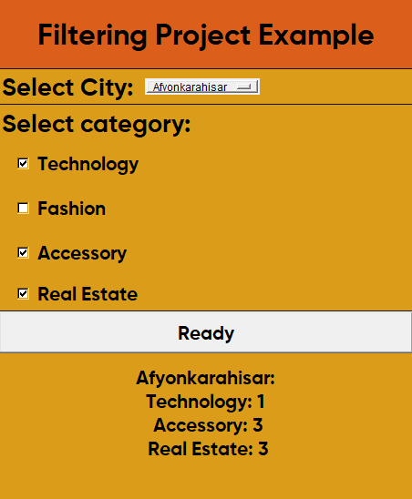

# Filtering Project Example

This simple application is a Tkinter GUI that displays data associated with the selection of a city and category.

## How to Use

1. **City Selection:**
   - Choose a city from the "Select City" menu located in the top right corner.

2. **Category Selection:**
   - Choose one or more categories from the "Select Category" section.

3. **Retrieve Data:**
   - Click the "Retrieve" button to display the data for the selected city and categories.

4. **Error Messages:**
   - If an invalid city or category selection is made, error messages will be displayed in the lower section.

## Example Screenshot



## Installation

Clone the project files to your computer and start the application by running the `main.py` file in the root directory.

```bash
python main.py
